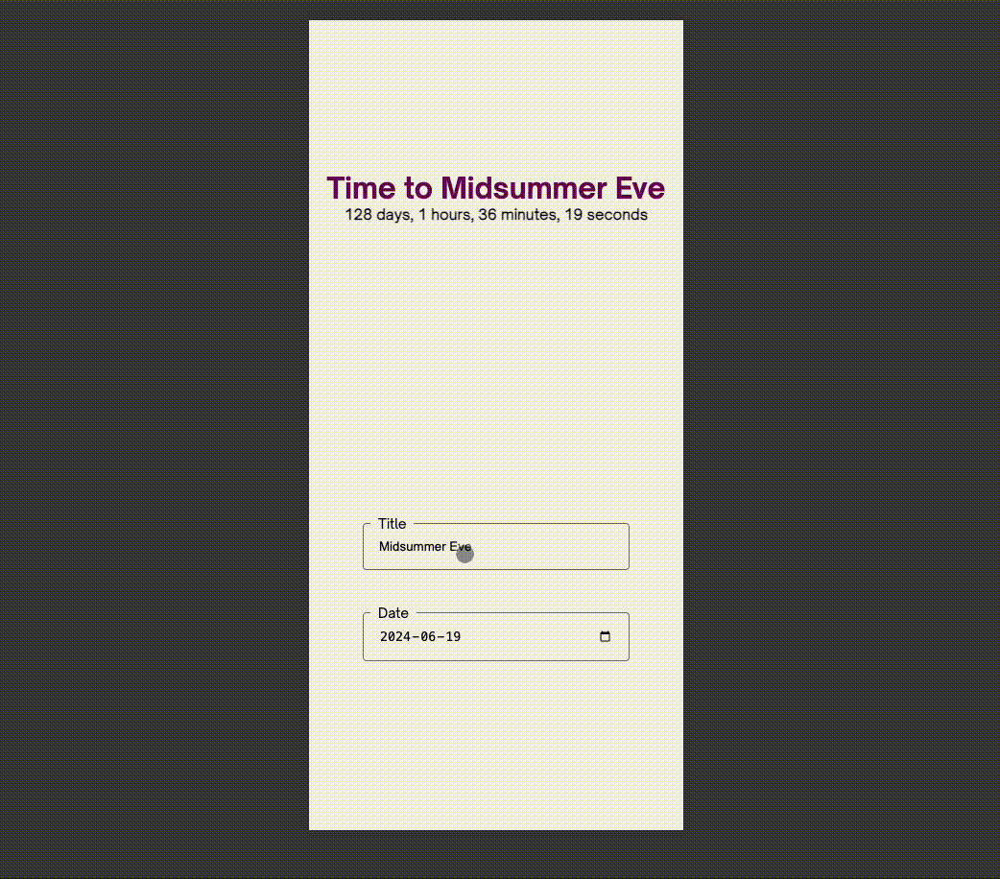

  <h1>NC Challenge</h1>
   
   
<h4>
    <a href="https://nc-challenge.vercel.app/">View Application</a>

 

<!-- TechStack -->

### :computer: Built using

  <ul>
    <li><a href="https://www.typescriptlang.org/">Typescript</a></li>
    <li><a href="https://angular.io/">Angular 17</a></li>
    <li><a href="https://sass-lang.com/guide/">Sass</a></li>
    <li><a href="https://angular.io/guide/signals">Angular Signals</a></li>
    <li><a href="https://developer.mozilla.org/en-US/docs/Web/API/Window/localStorage">Local Storage</a></li>
  </ul>

<!-- Colors -->

### :art: Colors

| Color  | Hex                                                              |
| ------ | ---------------------------------------------------------------- |
| Purple |  #72035d |
| Grey   |  #f5f3f3 |
| Input  |  #757575 |

### :rocket: Run Application

Run `ng serve` for a dev server. Navigate to `http://localhost:4200/`.

### :wrench: Improvements

- Write tests
- Oprimise font size scaling soluton

<!-- Screenshots -->

### :camera: Screenshots

